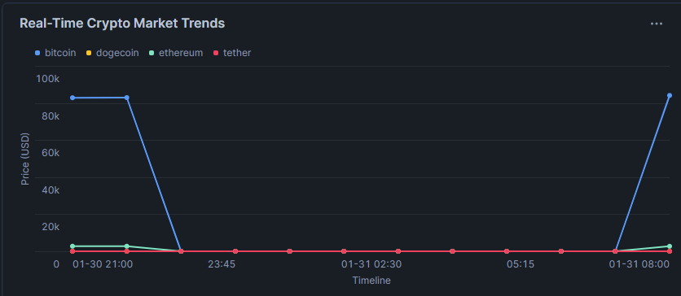

🪙 Crypto-to-Snowflake ETL Pipeline

This is an Automated Data Pipeline (ETL) that acts like a "Digital Courier." It fetches live cryptocurrency prices from the internet (Extraction), cleans the data so it's perfect (Transformation), and safely stores it in a professional Cloud Data Warehouse called Snowflake (Loading).

🚀 How it Works (The "Engine")

- Extraction: We talk to the CoinGecko API to get real-time prices for Bitcoin, Ethereum, and more.

- Transformation: Using Python and Pandas, we verify that the data isn't "broken" or missing values before we send it to our database.

- Loading: We use a "Smart Upload" (Idempotent MERGE) in Snowflake. This ensures that even if you run the script 100 times, you never get messy duplicate data.

- Logging: Every time the pipeline runs, it writes a "diary entry" in a Logs Table. If something fails, the pipeline tells us exactly why.

📂 What's Inside?

main.py: The "Brain" of the project that starts the whole process.

src/: The "Internal Parts" (Extract, Transform, Load, and Logger modules).

database_setup.sql: The blueprint to build the tables in Snowflake.

analysis_queries.sql: The smart math used to turn raw data into a dashboard.

dashboard_view.png: A screenshot of our final results.

📊 Final Results: Live Market Monitor

The pipeline feeds this live dashboard, allowing users to track price trends across multiple assets instantly.

🛠️ How to Run it Yourself

- Prepare Snowflake: Run the code in database_setup.sql inside your Snowflake account.

- Add Credentials: Put your Snowflake username/password into the .env file.

- Install Tools: Run pip install -r requirements.txt in your terminal.

- Launch: Run python main.py

